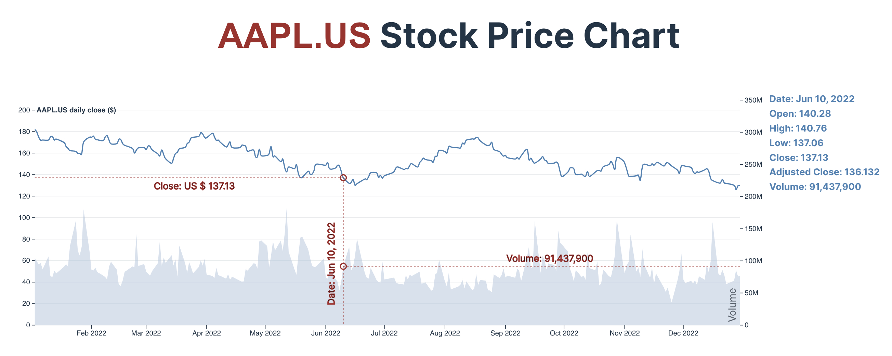
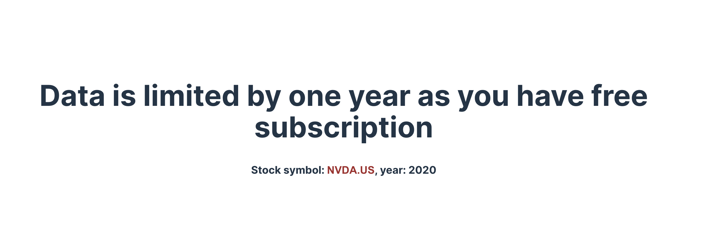

# React + D3 Stock Chart Demo

The demo app uses API from [Unicorn Data Services](https://eodhd.com/) (register to get a free API key). Documentation is available [here](https://eodhd.com/financial-apis/api-for-historical-data-and-volumes/). Note that the free API key is limited to 20 requests per day.

The chart renders the daily close price of the selected stock for a full year.

## Libraries used
- [Vite](https://vitejs.dev/)
- [React](https://react.dev/)
- [d3](https://d3js.org/)
- [Dayjs](https://day.js.org/)

## How to launch the app

Open the file [App.tsx](./src/App.tsx) in your editor and edit the values of [`stockSymbol`](./src/App.tsx#L5) and [`year`](./src/App.tsx#L6) constants to get from the API the data of the desired stock for the desired year.

If you have your API key from Unicorn Data Services, rename the [`.env.example`](https://github.com/welf/react-d3-stock-chart-demo/blob/main/.env.example) file to the `.env` in the root of the app and add your key as `VITE_APP_EODHD_API_TOKEN`. Otherwise, the demo key will be used.

Then run in your terminal:
```
npm install
npm run dev
```
and navigate to the URL you see in the terminal.


## Screenshots



Free API keys have some restrictions. If you encounter them, then you get from the API a warning instead of data. In such cases, the warning message is shown instead of a stock chart:
